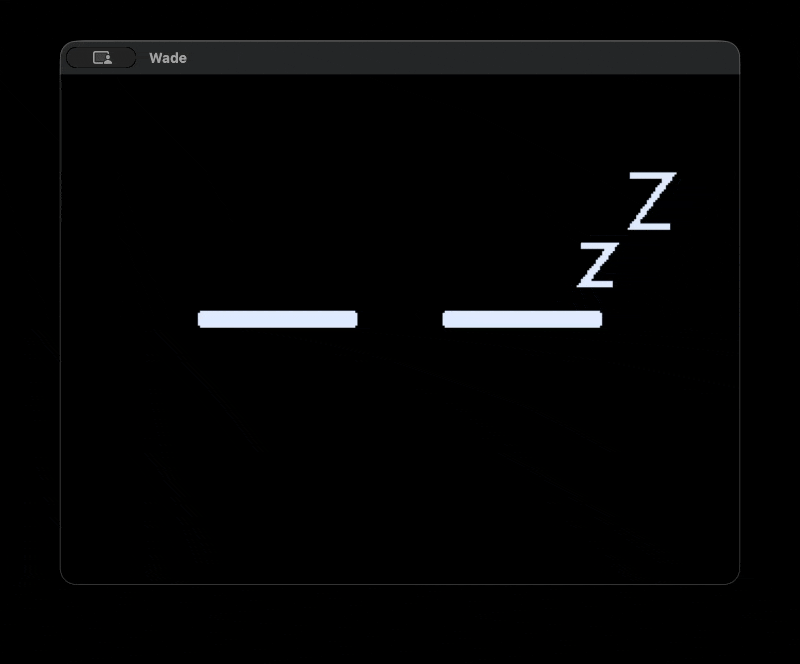

# wade

[](https://github.com/clarkedb/wade/actions/workflows/ci.yml)

my desk buddy

Wade is an animated desk companion for the M5Stack CoreS3 Lite, developed and tested on desktop first. Design docs live in [docs/](docs/README.md); the plan is in [docs/roadmap.md](docs/roadmap.md).

<p align="center">
  
</p>

## Layout

| Path | Contents |
|---|---|
| `wade-core/` | `no_std`, allocation-free core: behavior, layout, drawing |
| `wade-desktop/` | Desktop simulator (SDL2 window, record and replay) |
| `wade-cores3/` | Firmware for the device (from M3; outside the workspace) |
| `spikes/` | Throwaway experiments (outside the workspace) |

## Setup

The toolchain is pinned in `rust-toolchain.toml`; `rustup` installs it on first use.

```sh
brew install sdl2
# On Apple Silicon, if linking fails to find SDL2:
export LIBRARY_PATH="$LIBRARY_PATH:$(brew --prefix)/lib"
```

## Run

```sh
cargo run -p wade-desktop -- --seed 42
```

Click Wade to tap him, or the bottom-right corner to open the timer; number keys 0–9 show each expression, Z puts him to sleep, and P switches between pupils and plain eyes. Flags: `--seed <n>`, `--time-scale <x>` (`10` finishes a 5:00 timer in 30 s), `--record <file>`, and `--replay <file>`.

## Checks

CI runs these on every push. The pre-commit hook runs all but the tests, applying format and clippy fixes; enable it with `git config core.hooksPath .githooks`.

```sh
cargo fmt --all --check
cargo clippy --workspace --all-targets -- -D warnings
cargo test --workspace
cargo clippy -p wade-core --lib --target thumbv7em-none-eabihf -- -D warnings
! grep -rnE "extern[[:space:]]+crate[[:space:]]+alloc" wade-core/src
```

`UPDATE_SNAPSHOTS=1 cargo test` rewrites golden images in `wade-core/tests/snapshots/`.
