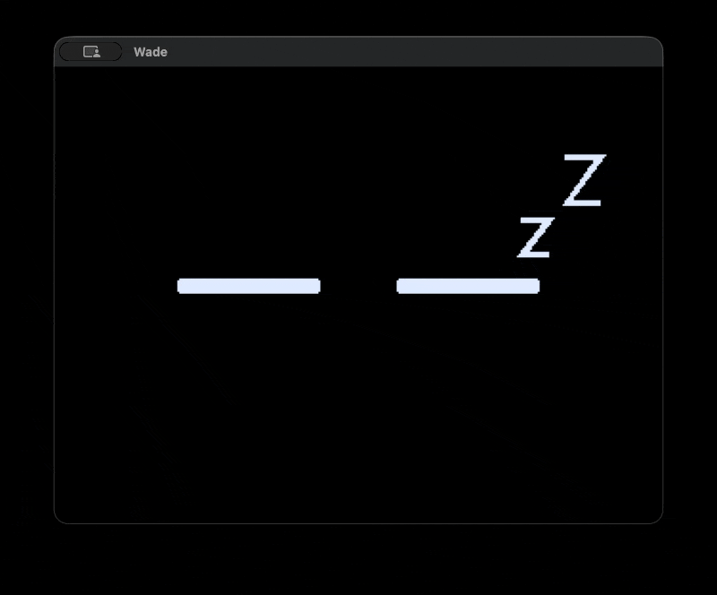

# wade

[](https://github.com/clarkedb/wade/actions/workflows/ci.yml)

my desk buddy

Wade is an animated desk companion, developed on desktop first. He currently runs on the M5Stack CoreS3 Lite and CYD (ESP32-2432S028R). New hardware ports are welcome; the [contribution guide](CONTRIBUTING.md#new-hardware) covers requirements and adding support. Design docs live in [docs/](docs/README.md); the plan is in [docs/roadmap.md](docs/roadmap.md).

<p align="center">
  
</p>

## Setup

The toolchain is pinned in `rust-toolchain.toml`; `rustup` installs it on first use.

```sh
brew install sdl2
# On Apple Silicon, if linking fails to find SDL2:
export LIBRARY_PATH="${LIBRARY_PATH:+$LIBRARY_PATH:}$(brew --prefix)/lib"
```

## Run

```sh
cargo run -p wade-desktop -- --seed 42
```

Click Wade to tap him, or use the bottom-right corner to open the Launcher, then choose Timer. Number keys 0–9 show each expression, Z puts him to sleep, and P switches between pupils and plain eyes. Flags: `--seed <n>`, `--time-scale <x>` (`10` finishes a 5:00 timer in 30 s), `--record <file>`, and `--replay <file>`.

## Firmware

Install a prebuilt package from [Releases](https://github.com/clarkedb/wade/releases).
[Installation and updates](docs/releases.md#usb-installation) cover both boards,
settings preservation, and USB recovery. Building from source is for development:

`wade-cores3` runs on the CoreS3 Lite and `wade-cyd` on the CYD. Install Espressif's toolchain once, then flash over USB and watch the log:

```sh
cargo install espup espflash --locked
espup install
. ~/export-esp.sh   # in each new shell
cd wade-cores3 && cargo run --release   # or wade-cyd
```

## Checks

CI runs these on every push. The pre-commit hook runs all but the tests, applying format and clippy fixes; enable it with `git config core.hooksPath .githooks`.

```sh
cargo fmt --all --check
cargo clippy --workspace --all-targets -- -D warnings
cargo test --workspace
cargo clippy -p wade-core -p wade-firmware --lib --target thumbv7em-none-eabihf -- -D warnings
! grep -rnE "extern[[:space:]]+crate[[:space:]]+alloc" wade-core/src wade-firmware/src
```

`UPDATE_SNAPSHOTS=1 cargo test` rewrites golden images in `wade-core/tests/snapshots/`.
